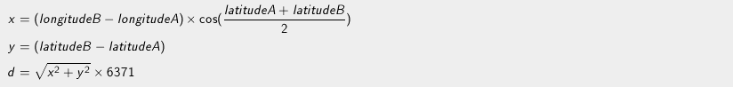

# Information for "Defibrillators"

### Rules and Implementation

This problem is simple: given the position of a user and a list of nearby defibrillators, we want to find the closest defibrillator to the user.  Each defibrillator is given a description that looks like the following:

    ID #;Name;Address;Contact Phone Number;Longitude in degrees;Latitude in degrees
    
A typical test case input looks like this:

* __Line 1__: The user's longitude in degrees
* __Line 2__: The user's latitude in degrees
* __Line 3__: The number `N` of nearby defibrillators to be analyzed
* __Next N Lines__: The `N` defibrillators, with descriptions in the above format.

Distance between the user's position and each defibrillator can be calculated using this formula.

Note, however, that these formulas assume the latitude and longitude are in radians, so we have to convert our data from degrees. Once we find the closest defibrillator, we simply print out its name to finish the test case.

An example test case input is as follows:

    3,879483
    43,608177
    3
    1;Maison de la Prevention Sante;6 rue Maguelone 340000 Montpellier;;3,87952263361082;43,6071285339217
    2;Hotel de Ville;1 place Georges Freche 34267 Montpellier;;3,89652239197876;43,5987299452849
    3;Zoo de Lunaret;50 avenue Agropolis 34090 Mtp;;3,87388031141133;43,6395872778854
    
To clean up the longitude and latitude from this input, we replace the commas with dots, convert the strings to floats and run them through `math.radians`. From here, it's a simple matter of hardcoding the above formulas and comparing the resulting distances, then printing out the name of the closest defibrillator, in this case `Maison de la Prevention Sante`.

### Original Codingame Problem

https://www.codingame.com/training/easy/defibrillators
