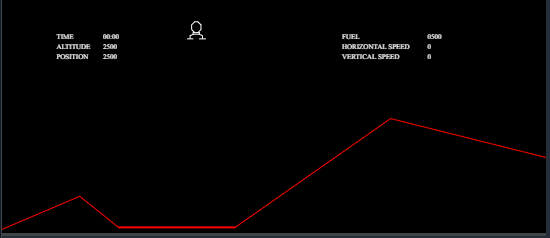

# Information for "Mars Lander - Ep. 1"

### Rules and Implementation

This is easily the most complicated of the easy set in terms of rules and constraints, but the problem is simplified in such a way that the solution is small and simple. Before covering that solution, however, I feel it is valuable to go over the aforementioned rules and constraints.

For starters, we are trying to land a lander on the surface of Mars. The landing zone (our effective play area) is 3000 m high and 7000 m wide. We start at a random point at the top of this area, and we are trying to land in the "safe zone" - a unique area of flat ground that extends for 1000m. For each round of game input, we have to supply a thrust power (from 0 to 4 m/s^2) and a tilt angle (from -90 to 90 degrees). Gravity is simulated at 3.711 m/s^2, so we have to thrust downward at full force in order to counteract our free fall. Each turn of thrust consumes fuel - 1 m/s^2 of thrust corresponds to 1 liter of fuel.

This is a lot to keep track of, but this initial puzzle is simplified considerably.

* The landing zone is underneath the shuttle, so we can always output 0 as our thrust angle and ignore rotation as a factor entirely.
* The surface coordinates don't need to be stored in order to solve this test.
* Our horizontal speed starts at 0 and doesn't need to be changed. Our vertical speed just has to be between 0 and 40 m/s inclusive - a fairly generous range.

### Example Case and Explanation

Essentially, all we have to do to land the rover is wait until we're falling at our maximum allowed landing speed, crank up the thrust to maximum, and slowly kill our vertical speed, landing on the safe zone going roughly 30 m/s.
