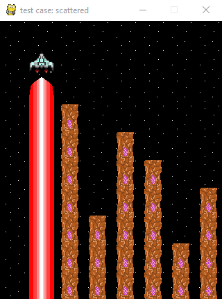

# Information for "The Descent"
 	
### Background

The objective of this game is simple. You are in a spaceship at a starting altitude *x*. 
There are between 1 and 8 mountains below you, with heights in the range (0, *x*-1) inclusive.
Your spaceship will reduce its altitude by 1 every turn.
If it runs into a mountain, the game is over.
Your spaceship must identify the tallest mountain in its path and zap it, which reduces the height of the mountain by some amount.

### Original Codingame Inplementation

https://www.codingame.com/ide/puzzle/the-descent<br><br>
The requirements of the original puzzle were simple.
Write code such that, given some mountains of varying heights, your program identifies and prints the index of the tallest mountain.
My original solution looked like this.

    heights = []

    while True:
        for i in range(8):
            mountain_h = int(input())
            heights.append(mountain_h)

        tallest = heights.index(max(heights))
        print(str(tallest))

        heights.clear()
        
The infinite loop breaks when the final mountain is destroyed, and each round of input provides 8 integers representing the current height of the mountains.
The expected output for each round is a printed string, representing the index of the chosen mountain to zap.
Note that the game will end if, for any round, incorrect output is provided.
As an additional constraint, the mountains' heights are always in the range (0, 9) inclusive, with the player's height starting at 10.
I also believe that no two mountains may be the same height if they are directly below the player height.
Because only one mountain can be zapped per game round, this would always lead to a crash.

### My Implementation

#### Test Cases

The first facet of implementing this game from scratch was pulling the data from the test cases provided on codingame, and putting it in a usable format.
This was done by creating two directories in the project: ```test_cases``` and ```expected_output```.
A test case input file looks something like this:<br>

    9,8,7,3,6,5,2,4
    0,8,7,3,6,5,2,4
    0,0,7,3,6,5,2,4
    0,0,0,3,6,5,2,4
    0,0,0,3,0,5,2,4
    0,0,0,3,0,0,2,4
    0,0,0,3,0,0,2,0
    0,0,0,0,0,0,2,0
    0,0,0,0,0,0,0,0

Each line of this file represents the heights of the mountains at a particular game round.
The corresponding output file looks like this:<br>

    0,1,2,4,5,7,3,6
    
Each number in this list represents the index of the tallest mountain at a particular game round.
This is what we are trying to generate.<br>
Every test case has a name, and that name is used to identify an input and output file.
The above examples are from the test case "Scattered Mountains", so the corresponding files are ```test_cases/scattered.csv``` and ```expected_output/scattered.csv```.
These files are processed and converted to lists of integers for use in the program.

#### Console Display

The ASCII display box follows some basic rules for drawing the game board.
There are six distinct characters used to draw the board.
* ```|``` and ```-``` : These are used to draw the borders of the game, and their positions never change.
* ```X``` and ```.``` : Used to draw mountains and empty sky, respectively.
* ```o``` : Used to draw the spaceship, which moves back and forth across the sky each game round.
* ```V``` : Used to draw the laser, which is drawn once per game round, when the spaceship is over the mountain selected to be zapped.

The initial game board for ```scattered``` looks like this:<br>

    - - - - - - - - - - 
    | o . . . . . . . |
    | V . . . . . . . |
    | V X . . . . . . |
    | V X X . . . . . |
    | V X X . X . . . |
    | V X X . X X . . |
    | V X X . X X . X |
    | V X X X X X . X |
    | V X X X X X X X |
    | V X X X X X X X |
    - - - - - - - - - -
    
When a mountain is zapped, it is drawn at the height it will have in the next round immediately following the zap, to mimic the original look of the Codingame implementation as closely as possible.

#### Terminal Display

Using ```curses```, I've implemented a static display which draws to the terminal rather than printing each frame in the console.
The result is considerably cleaner, and requres only a few lines of code added to my initial console display.
Because the console display constructs a game board as a string, this string can be statically printed in the terminal with minimal changes.

#### Graphical Display

```pygame``` is used to generate the graphical display of each test case. 
There are five 40x40 images used: the spaceship, empty space, a mountain tile, the laser, and the start of the laser, placed directly under the ship to look more natural than a massive block of color.
The other display modes rely on constructing a string from scratch because strings are immutable, but a pygame surface can be modified with considerably more freedom. 
The code only draws as many images as necessary for a game round, to avoid redrawing the entire screen one tile at a time every frame.
The graphical representation looks something like this:<br><br>

