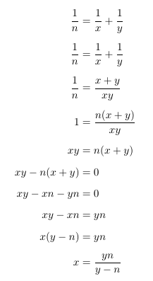
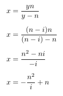

# Information for "Unit Fractions"

### Introduction and Example

Given a number `n`, we can always find two numbers `x` and `y` such that `x` > `y` and `1/x + 1/y = 1/n`. This problem supplies `n`, and we have to find all combinations of `x` and `y` that fit these criteria, in descending order.

This is much more of a mathematics / number theory problem than a coding problem. The code itself is fairly simple, requiring only a few lines in total. Here's a small example:

    given n = 2
    1/2 = 1/6 + 1/3
    1/2 = 1/4 + 1/4
    
This appears simple with small numbers, but what about for `n > 10000`, or even `n > 100000`? Those cases can be handled in O(`n`) time with some number theory and algebra.

### I/O Format

#### Input

* __Line 1:__ `n`, an integer. 

#### Output

All equations of the form `1/n = 1/x + 1/y`, where `x >= y`. The list should be sorted by `x` in descending order, with each equation on its own line.

### Explanation of Underlying Mathematics

Essentially, we can break this problem down into a simple equivalence; we do this by manipulating the general form of its solutions such that we can easily relate x and y to each other in terms of n.

We see that `x` is given by `yn / (y - n)`, and we can use this to place some bounds on `y`. 

For the lower bound, `y >= n + 1`. In the case of `y = n`, `y - n = 0`, and we cannot divide by zero to calculate `x`. For all other cases, let's represent `y` as `n - i`, where `i` is in the range `[1, n)`. The general form of `x` then looks like this:

If `1 <= i < n`, then if `n^2 / i` is an integer, it is guaranteed to be larger than `n` by the definition of division. Therefore `x = - n^2 / i + n` will always be negative, and `x` cannot be a negative integer. Thus `y` is bounded by `[n+1, ?)`.

The upper bound is slightly simpler. If our initial fraction is `1 / n`, then half of that fraction is `1 / 2n`. If `y > 2n`, then this means that `1 / y` takes up less than half of the total value of the fraction. Therefore, `y` must be greater than `x` in order for `x` to take up a larger portion than `1 / 2n`. We know from the problem constraints that `x >= y` for all valid solutions, so `y` is bounded by `[n+1, 2n]`.

So, now we know two key pieces of information:

1. `x = yn / (y - n)`
2. `n + 1 <= y <= 2n`

All that remains is to substitute in all possible values of `y` for the given `n` and determine which ones give us integer solutions of `x`. We then write these solutions in the form `1/n = 1/x + 1/y` to complete our problem.

### Code Walkthrough

Essentially, we perform exactly the operations described in the above section with a range and simple for loop. Because we evaluate `y`s in ascending order, our solutions are discovered in descending order of `x`. 

    n = int(input())
    solns = []

    for i in range(1,n+1):

        y = n + i
        x = (n * y) / i

        if x.is_integer():
            solns.append((int(x), y))

    for soln in solns:
        print("1/" + str(n) + " = 1/" + str(soln[0]) + " + 1/" + str(soln[1]))
        
### Original Codingame Problem

https://www.codingame.com/training/easy/unit-fractions
